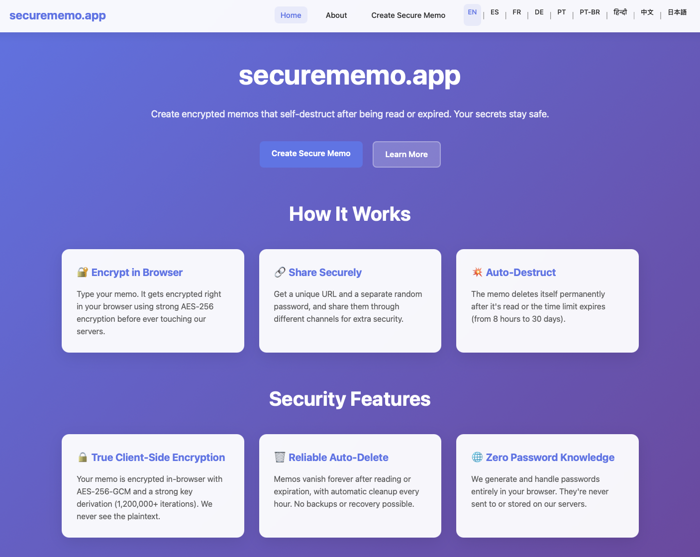
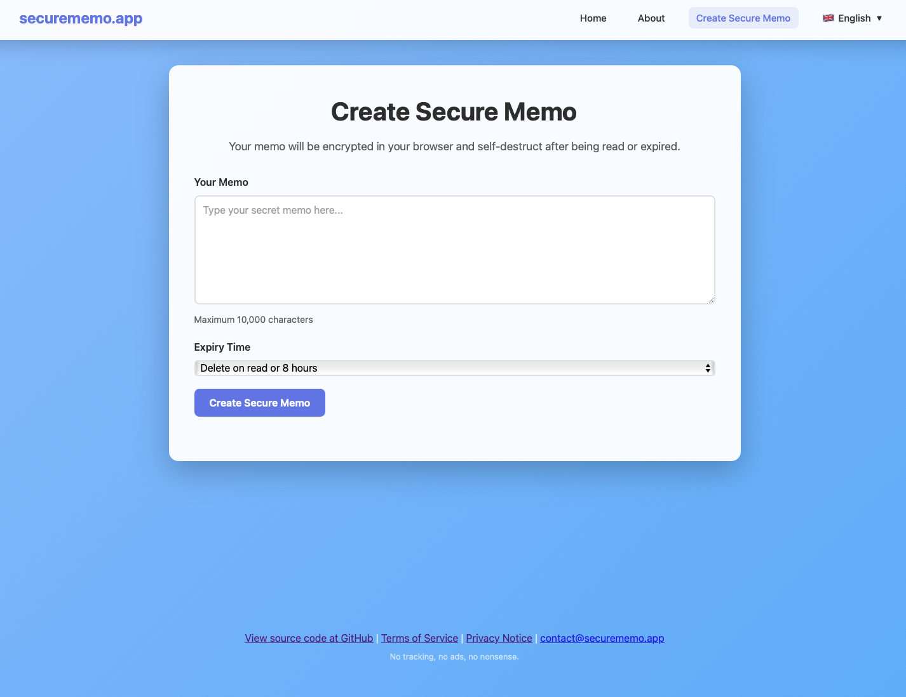

# securememo.app

> A privacy-focused service for sharing sensitive memos securely with client-side encryption and automatic self-destruction.

securememo.app is a simple, privacy-focused service for sharing sensitive memos securely. All encryption occurs client-side in your browser using AES-256-GCM with PBKDF2 key derivation—ensuring that plaintext is never transmitted or stored on the server. Each memo self-destructs permanently after being read or upon expiration.

[](https://github.com/timoheimonen/securememo.app/blob/main/LICENSE)
[](https://github.com/timoheimonen/securememo.app/actions/workflows/ci.yml)
[](https://github.com/timoheimonen/securememo.app/security/code-scanning)
[](https://github.com/timoheimonen/securememo.app/stargazers)
[](https://github.com/timoheimonen/securememo.app/network/members)
[](https://github.com/timoheimonen/securememo.app/graphs/contributors)
[](https://github.com/timoheimonen/securememo.app/commits/main)

## Table of Contents

- [🚀 Demo](#-demo)
- [📸 Screenshots](#-screenshots)
- [✨ Features](#-features)
- [🏁 Getting Started](#-getting-started)
  - [Prerequisites](#prerequisites)
  - [Installation](#installation)
  - [Development](#development)
- [🏗️ Architecture](#️-architecture)
- [🔒 Security](#-security)
- [🛠️ Development](#️-development)
- [🤝 Contributing](#-contributing)
- [🌍 Supported Languages](#-supported-languages)
- [📄 License](#-license)
- [👤 Author](#-author)
- [🏷️ Tags](#️-tags)

## 🚀 Demo

**Live Application:** [https://securememo.app](https://securememo.app)

The production application runs the latest version from the `main` branch of this repository.

## 📸 Screenshots

<div align="center">


*Secure memo creation interface with client-side encryption*


*Clean and secure memo reading experience*

</div>

## ✨ Features

- **True end-to-end encryption**: Performed entirely in the browser; servers handle only encrypted data.
- **Password protection**: Random passwords are generated client-side and never sent to or stored on the server.
- **One-time access**: Memos automatically delete after being read or when the selected time limit expires.
- **Flexible expiry options**: Choose from delete-on-read with timeouts of 8 hours, 1 day, 2 days, 1 week, or 30 days.
- **Powered by Cloudflare Workers**: Ensures fast, scalable, and globally distributed performance.
- **D1 Database**: Utilizes SQLite-compatible storage for reliable, encrypted memo persistence.
- **Turnstile CAPTCHA**: Prevents bot abuse and spam while maintaining user privacy (no tracking).
- **Robust security headers**: Includes strict CSP, HSTS, and other policies to mitigate common web vulnerabilities.
- **Automated cleanup**: Expired or read memos are permanently removed via scheduled cron jobs.
- **Localization**: Currently supports 30 languages.

## 🏁 Getting Started

### Prerequisites

Before you begin, ensure you have the following installed:

- **Node.js** (v18 or higher)
- **npm** (comes with Node.js)
- **Cloudflare Account** (for deployment)
- **Wrangler CLI** (included in dev dependencies)

### Installation

1. **Clone the repository**
   ```bash
   git clone https://github.com/timoheimonen/securememo.app.git
   cd securememo.app
   ```

2. **Install dependencies**
   ```bash
   npm install
   ```

3. **Set up Cloudflare configuration**
   ```bash
   # Login to Cloudflare (follow the prompts)
   npx wrangler login
   
   # Create your D1 database
   npx wrangler d1 create your-database-name
   
   # Update wrangler.toml with your database ID
   # Copy the database_id from the output above
   ```

4. **Initialize the database**
   ```bash
   npm run db:migrate
   ```

### Development

1. **Start the development server**
   ```bash
   npm run dev
   ```
   This will start the Cloudflare Workers development environment locally.

2. **Access the application**
   Open your browser and navigate to the URL shown in the terminal (typically `http://localhost:8787`)

3. **Make changes**
   The development server will automatically reload when you modify source files.

4. **Deploy to production**
   ```bash
   npm run deploy:prod
   ```

## 🏗️ Architecture

### Tech Stack

- **Runtime**: Cloudflare Workers for serverless execution.
- **Database**: Cloudflare D1 (SQLite-based) for secure, efficient storage.
- **Frontend**: Vanilla JavaScript with ES6+ features for a lightweight, no-framework experience.
- **Security**: Cloudflare Turnstile CAPTCHA, Content Security Policy (CSP) headers, and comprehensive input sanitization.
- **Encryption**: Client-side AES-256-GCM with PBKDF2 (3,500,000+ iterations) for key derivation.

### Project Structure

```
securememo.app/
├── .eslintignore               # ESLint ignore patterns
├── .eslintrc.json              # ESLint configuration
├── .gitattributes              # Git attributes configuration
├── .gitignore                  # Git ignore patterns
├── .prettierignore             # Prettier ignore patterns
├── .prettierrc.json            # Prettier configuration
├── CODE_OF_CONDUCT.md          # Community guidelines
├── CONTRIBUTING.md             # Contribution guidelines
├── LICENSE                     # GPL-3.0 License
├── README.md                   # Project documentation
├── SECURITY.md                 # Security policy and vulnerability reporting
├── package.json                # Project dependencies and scripts
├── package-lock.json           # Dependency lock file
├── wrangler.toml               # Cloudflare Workers configuration
├── .github/                    # GitHub workflows and templates
├── db/
│   └── schema.sql              # Database schema definition
├── public/                     # Static assets
│   ├── android-chrome-192x192.png
│   ├── android-chrome-512x512.png
│   ├── apple-touch-icon.png
│   ├── favicon.ico
│   └── robots.txt
├── screenshots/                # Application screenshots
│   ├── screenshot_001.png      # Homepage interface
│   └── screenshot_002.png      # Memo reading interface
└── src/
    ├── index.js                # Main Worker entry point (routing, security headers, cron jobs)
    ├── handlers/               # API request handlers
    │   └── auth.js             # Handles memo creation, reading, confirmation, and cleanup
    ├── styles/                 # CSS styling
    │   └── styles.js           # Dynamic CSS generation
    ├── templates/              # HTML and JavaScript templates
    │   ├── js.js               # JavaScript templates (e.g., create/read memo logic)
    │   └── pages.js            # HTML page templates (e.g., index, about, create/read memo)
    ├── lang/                   # Localization and translation files
    │   ├── ar_translations.js  # Arabic translations
    │   ├── bn_translations.js  # Bengali translations
    │   ├── clientLocalization.js # Client-side localization utilities
    │   ├── cs_translations.js  # Czech translations
    │   ├── da_translations.js  # Danish translations
    │   ├── de_translations.js  # German translations
    │   ├── el_translations.js  # Greek translations
    │   ├── en_translations.js  # English translations
    │   ├── es_translations.js  # Spanish translations
    │   ├── fi_translations.js  # Finnish translations
    │   ├── fr_translations.js  # French translations
    │   ├── hi_translations.js  # Hindi translations
    │   ├── hu_translations.js  # Hungarian translations
    │   ├── id_translations.js  # Indonesian translations
    │   ├── it_translations.js  # Italian translations
    │   ├── ja_translations.js  # Japanese translations
    │   ├── ko_translations.js  # Korean translations
    │   ├── language_names.js   # Language names utility
    │   ├── localization.js     # Server-side localization utilities
    │   ├── nl_translations.js  # Dutch translations
    │   ├── no_translations.js  # Norwegian translations
    │   ├── pl_translations.js  # Polish translations
    │   ├── ptBR_translations.js # Portuguese (Brazil) translations
    │   ├── ptPT_translations.js # Portuguese (Portugal) translations
    │   ├── ro_translations.js  # Romanian translations
    │   ├── ru_translations.js  # Russian translations
    │   ├── sv_translations.js  # Swedish translations
    │   ├── th_translations.js  # Thai translations
    │   ├── tl_translations.js  # Tagalog translations
    │   ├── tr_translations.js  # Turkish translations
    │   ├── translations.js     # Translation registry
    │   ├── uk_translations.js  # Ukrainian translations
    │   ├── vi_translations.js  # Vietnamese translations
    │   └── zh_translations.js  # Chinese translations
    └── utils/                  # Utility functions
        ├── errorMessages.js    # Centralized error handling with generic messages
        ├── rateLimiter.js      # Rate limiting utilities
        ├── timingSecurity.js   # Timing attack protections (e.g., constant-time comparisons, artificial delays)
        └── validation.js       # Input validation, sanitization, and secure checks
```
## 🔒 Security

- **Client-side encryption**: Memos are encrypted in-browser using AES-256-GCM; servers receive only ciphertext.
- **Input sanitization**: Multi-context protection (HTML, JSON, database, URL) with entity encoding to prevent XSS and injection attacks.
- **Turnstile CAPTCHA**: Blocks automated abuse without user tracking or cookies.
- **Security headers**: Enforces strict CSP, HSTS, X-Frame-Options, and Permissions-Policy to defend against common threats.
- **Request validation**: Includes size limits (e.g., 100KB max), method checks, and secure origin validation for CORS.
- **Timing attack protection**: Implements constant-time comparisons, artificial delays, and secure validation to prevent information leakage.
- **Automatic cleanup**: Memos are deleted immediately after reading (via confirmation) or expiration, with no recovery possible.

## 🛠️ Development

### Available Scripts

- `npm run dev` - Start development server with live reload
- `npm run deploy` - Deploy to Cloudflare Workers
- `npm run deploy:dev` - Deploy to development environment
- `npm run deploy:prod` - Deploy to production environment
- `npm run db:create` - Create a new D1 database
- `npm run db:migrate` - Run database migrations
- `npm run lint` - Run ESLint code linting
- `npm run lint:fix` - Run ESLint with automatic fixes
- `npm run format` - Format code with Prettier
- `npm run format:check` - Check code formatting
- `npm run audit` - Run security audit

### Environment Configuration

The project supports multiple environments configured in `wrangler.toml`:

- **Development**: `securememo-dev` worker with debug logging
- **Production**: `securememo` worker with live domain routing

### Database Setup

1. Create a D1 database:
   ```bash
   npx wrangler d1 create your-database-name
   ```

2. Update `wrangler.toml` with the database ID

3. Run migrations:
   ```bash
   npm run db:migrate
   ```

### Security Considerations for Development

- Never commit real API keys or secrets
- Use environment variables for sensitive configuration
- Test security headers in development
- Validate input sanitization thoroughly
- Test rate limiting functionality

## 📄 License

This project uses GPL-3.0 license.

## 🤝 Contributing

You are welcome to contribute to the project in any way you can. This includes reporting bugs, auditing, suggesting features, or submitting pull requests via GitHub. Please ensure your contributions respect the project's security focus and follow standard open-source practices.

For detailed contribution guidelines, please see [CONTRIBUTING.md](CONTRIBUTING.md).

## 🌍 Supported languages in the application

SecureMemo supports **30 languages** with automatic translation from English:

<details>
<summary>Click to view all supported languages</summary>

| Language | Code | Language | Code |
|----------|------|----------|------|
| Arabic | `ar` | Japanese | `ja` |
| Bengali | `bn` | Korean | `ko` |
| Chinese | `zh` | Norwegian | `no` |
| Czech | `cs` | Polish | `pl` |
| Danish | `da` | Portuguese (Brazil) | `pt-BR` |
| Dutch | `nl` | Portuguese (Portugal) | `pt-PT` |
| English | `en` | Romanian | `ro` |
| Finnish | `fi` | Russian | `ru` |
| French | `fr` | Spanish | `es` |
| German | `de` | Swedish | `sv` |
| Greek | `el` | Tagalog | `tl` |
| Hindi | `hi` | Thai | `th` |
| Hungarian | `hu` | Turkish | `tr` |
| Indonesian | `id` | Ukrainian | `uk` |
| Italian | `it` | Vietnamese | `vi` |

</details>

> **Note:** These translations are auto-generated from English. Some errors may occur. Contributions for translation improvements are welcome!

## 👤 Author

🇫🇮 Timo Heimonen (timo.heimonen@proton.me)

## 🏷️ Tags

- #privacy
- #encryption
- #security
- #cloudflare
- #memos
- #note
- #secure
